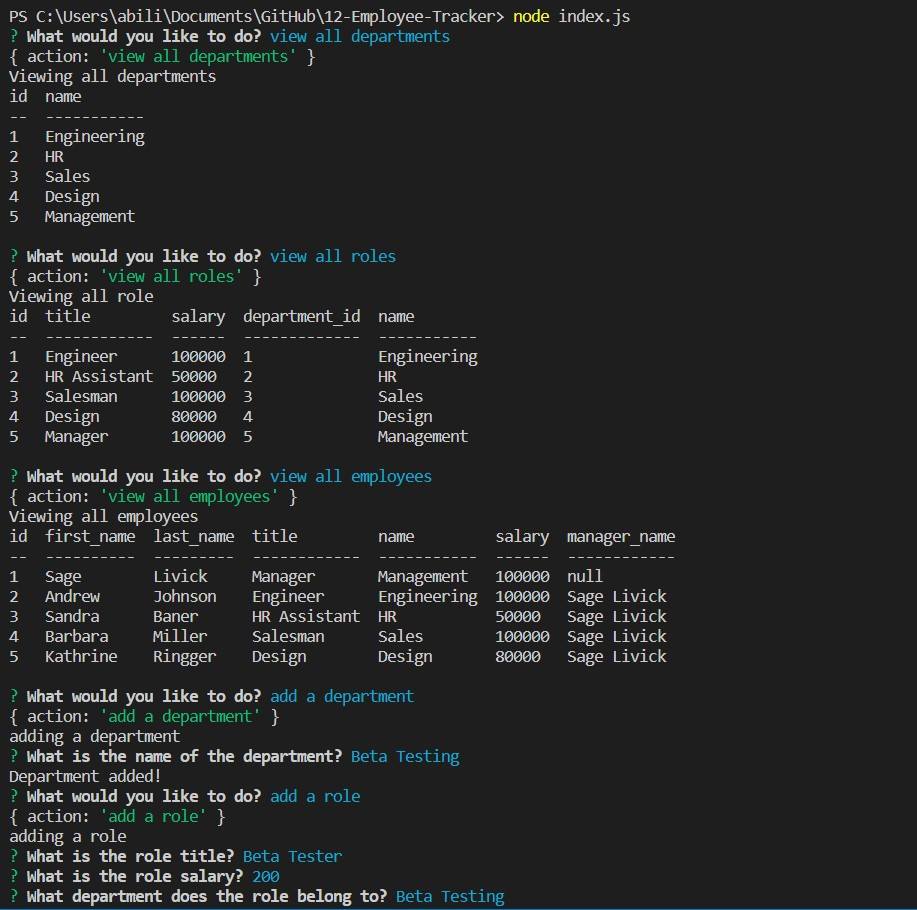

# 12-Employee-Tracker

## Description

An employee tracker utilizing Inquirer and Mysql. Allows the user to view, all departments, all roles, all employees, and employees by manager, as well as add a department, roll, or employee. User can also update an employee's role or manager.

[Video Link](https://drive.google.com/file/d/1dc2OVgFZXuB8e7-tDlQj5uMiVJXtb3OQ/view)

## Table of Contents

1. [Installation](#installation)
2. [Usage](#usage)
3. [License](#license)
4. [Contribution](#contribution)
5. [Testing](#testing)

## Installation

npm install

## Usage

n/a

## License

None

## Contribution

n/a

## Testing

n/a

## Questions

Email me at [abilivick@gmail.com](mailto:abilivick@gmail.com) or explore more projects at [lailiel](https://www.github.com/lailiel)
